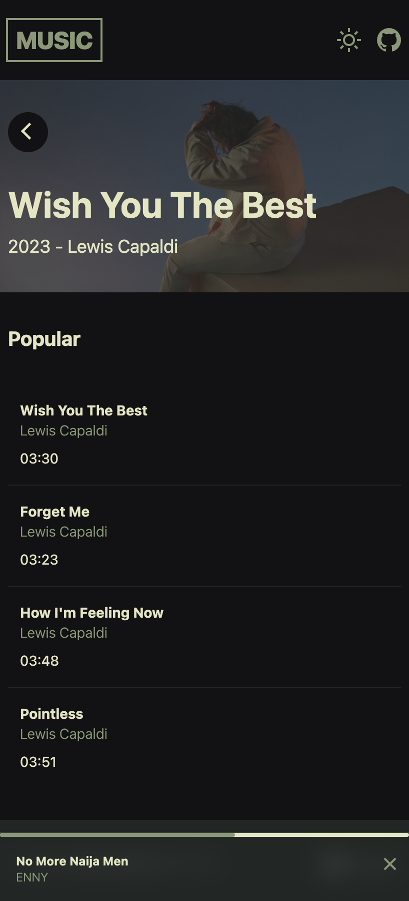
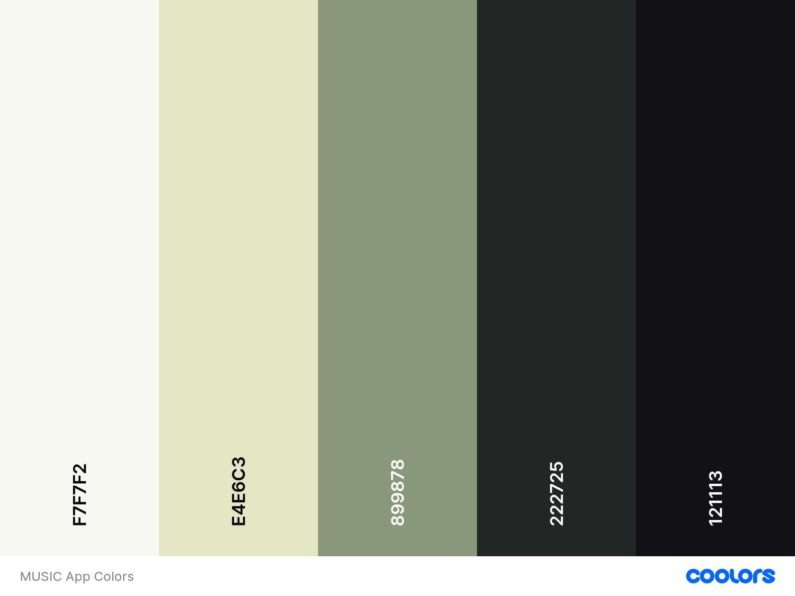

# SvelteKit Music App Example

The project was created as part of the [Sveltekit Hackerthon](https://hack.sveltesociety.dev/) and is intended to show examples of how to connect and process data as well as some practical examples of how to develop frontend components with tailwindcss.
The project is open source and collaboration / further development is welcome.

<table><tr>
<td>  </td>
<td>  </td>
</tr></table>

[Live Demo](music-tayfuuu.vercel.app)

## Develope

```bash
# 1. clone this repository
git clone https://github.com/tguelcan/music.git
```

2. [Register](https://developer.spotify.com/dashboard/create) an application on spotify developer and get the client & secred keys

```bash
# 3. rename .env.example to .env and complete the variables with spotify client id and client secret
mv .env.example .env
```

```bash
# 4. run local
yarn && yarn dev
```

## Deploy

For vercel, you do not need any further configuration except to adjust the environment variables.

[](https://vercel.com/new/clone?repository-url=https%3A%2F%2Fgithub.com%2Ftguelcan%2Fmusic&env=SPOTIFY_CLIENT_ID,SPOTIFY_CLIENT_SECRET&envDescription=Spotify%20client%20id%20and%20secred%20needed%20for%20this%20application&project-name=musicapp)

> To deploy your app with another adapter, take a look [adapter](https://kit.svelte.dev/docs/adapters) for your target environment.

## Parts used

### Toolchains

- [Adapter Vercel](https://vercel.com/docs/beginner-sveltekit/adapters)
- [Spotify Developer](https://developer.spotify.com)

### Design

Colors
<br/>
[coolors](https://coolors.co/f7f7f2-e4e6c3-899878-222725-121113)

- [css.gg](https://css.gg/) icons
- Raleway [Google font](https://fonts.google.com/specimen/Raleway) with [unplugin-fonts](https://github.com/cssninjaStudio/unplugin-fonts) for vite.
- [TailwindCSS](https://tailwindcss.com/)

### Upcoming

- User authentication
- Search function
